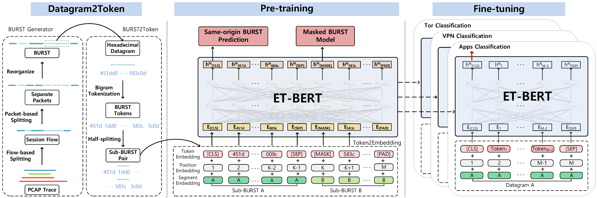

## Overview
This is a customized ET-BERT model for classifying network traffic. We've modified it to work specifically with Time, Direction, and Length (TDL) data.

## Setup Steps

### Download Pretrained Model
Before running the model, you need to download the pretrained model. Here are the steps:

1. Download the pretrained model from [this link](https://drive.google.com/file/d/1r1yE34dU2W8zSqx1FkB8gCWri4DQWVtE/view?usp=sharing).
2. Once downloaded, place the model file in the `models` directory of your project.

## Data Preparation
Here's how to prepare your data:

1. **For pcap Files:**
   - Go to the `data_process` directory.
   - Run `dataset_generation.py`.
     ```bash
     python data_process/dataset_generation.py
     ```
   - Check that the file paths in the script are correct for your files.

2. **For Text Files:**
   - Make a DataFrame with these columns: `time`, `direction`, `length`, `label`, `flownum`.
   - Run `etbert_text_util.py` in the same directory.
     ```bash
     python data_process/etbert_text_util.py
     ```
   - Ensure the script's file paths are set to where your DataFrame is located.
   - In `etbert_text_util.py`, you can set the `packet_threshold` variable to define the number of packets to use from each session.

## Running the Model
1. Run `main.py` in the `data_process` directory.
   ```bash
   python data_process/main.py
   ```

2. Set the `PYTHONPATH` environment variable to include the path to ET-BERT. This tells Python where to find the ET-BERT module when running your scripts.

   - **For Linux/macOS:**
     ```bash
     export PYTHONPATH="${PYTHONPATH}:/path/to/ET-BERT"
     ```
     Replace `/path/to/ET-BERT` with the actual path to the ET-BERT directory.

   - **For Windows (PowerShell):**
     ```powershell
     $Env:PYTHONPATH = "$Env:PYTHONPATH;C:\path\to\ET-BERT"
     ```
     Replace `C:\path\to/ET-BERT` with the actual path to the ET-BERT directory. This command only sets the `PYTHONPATH` for the current PowerShell session. If you open a new session, you'll need to set it again.

3. To run the model, use this command, adjusting the file paths and parameters for your setup:
   ```bash
   python <path_to_ET-BERT>/fine-tuning/run_classifier.py --pretrained_model_path <path_to_pretrained_model>/pretrained_model.bin --vocab_path <path_to_vocab>/encryptd_vocab.txt --train_path <path_to_dataset>/train_dataset.tsv --dev_path <path_to_dataset>/valid_dataset.tsv --test_path <path_to_dataset>/test_dataset.tsv --epochs_num 5 --batch_size 8 --embedding word --encoder transformer --mask fully_visible --seq_length 270 --learning_rate 2e-5
   ```
   Modify `<path_to_ET-BERT>`, `<path_to_pretrained_model>`, `<path_to_vocab>`, and `<path_to_dataset>` as needed.


# Original README


# ET-BERT

[](https://codebeat.co/projects/github-com-linwhitehat-et-bert-main)

[](https://arxiv.org/abs/2202.06335)

**Note:**
- ⭐ **Please leave a <font color='orange'>STAR</font> if you like this project!** ⭐
- If you find any <font color='red'>incorrect</font> / <font color='red'>inappropriate</font> / <font color='red'>outdated</font> content, please kindly consider opening an issue or a PR. 

**The repository of ET-BERT, a network traffic classification model on encrypted traffic.**

ET-BERT is a method for learning datagram contextual relationships from encrypted traffic, which could be **directly applied to different encrypted traffic scenarios and accurately identify classes of traffic**. First, ET-BERT employs multi-layer attention in large scale unlabelled traffic to learn both inter-datagram contextual and inter-traffic transport relationships. Second, ET-BERT could be applied to a specific scenario to identify traffic types by fine-tuning the labeled encrypted traffic on a small scale.



The work is introduced in the *[31st The Web Conference](https://www2022.thewebconf.org/)*:
> Xinjie Lin, Gang Xiong, Gaopeng Gou, Zhen Li, Junzheng Shi and Jing Yu. 2022. ET-BERT: A Contextualized Datagram Representation with Pre-training Transformers for Encrypted Traffic Classification. In Proceedings of The Web Conference (WWW) 2022, Lyon, France. Association for Computing Machinery. 

Note: this code is based on [UER-py](https://github.com/dbiir/UER-py). Many thanks to the authors.
<br/>

Table of Contents
=================
  * [Requirements](#requirements)
  * [Datasets](#datasets)
  * [Using ET-BERT](#using-et-bert)
  * [Reproduce ET-BERT](#reproduce-et-bert)
  * [Citation](#citation)
  * [Contact](#contact)
<br/>

## Requirements
* Python >= 3.6
* CUDA: 11.4
* GPU: Tesla V100S
* torch >= 1.1
* six >= 1.12.0
* scapy == 2.4.4
* numpy == 1.19.2
* shutil, random, json, pickle, binascii, flowcontainer
* argparse
* packaging
* tshark
* [SplitCap](https://www.netresec.com/?page=SplitCap)
* [scikit-learn](https://scikit-learn.org/stable/)
* For the mixed precision training you will need apex from NVIDIA
* For the pre-trained model conversion (related with TensorFlow) you will need TensorFlow
* For the tokenization with wordpiece model you will need [WordPiece](https://github.com/huggingface/tokenizers)
* For the use of CRF in sequence labeling downstream task you will need [pytorch-crf](https://github.com/kmkurn/pytorch-crf)
<br/>

## Datasets
The real-world TLS 1.3 dataset is collected from March to July 2021 on China Science and Technology Network (CSTNET). For privacy considerations, we only release the anonymous data (see in [CSTNET-TLS 1.3](CSTNET-TLS%201.3/readme.md)).

Other datasets we used for comparison experiments are publicly available, see the [paper](https://arxiv.org/abs/2202.06335) for more details. If you want to use your own data, please check if the data format is the same as `datasets/cstnet-tls1.3/` and specify the data path in `data_process/`.

<br/>

## Using ET-BERT
You can now use ET-BERT directly through the pre-trained [model](https://drive.google.com/file/d/1r1yE34dU2W8zSqx1FkB8gCWri4DQWVtE/view?usp=sharing) or download via:
```
wget -O pretrained_model.bin https://drive.google.com/file/d/1r1yE34dU2W8zSqx1FkB8gCWri4DQWVtE/view?usp=sharing
```

After obtaining the pre-trained model, ET-BERT could be applied to the spetic task by fine-tuning at packet-level with labeled network traffic:
```
python3 fine-tuning/run_classifier.py --pretrained_model_path models/pre-trained_model.bin \
                                   --vocab_path models/encryptd_vocab.txt \
                                   --train_path datasets/cstnet-tls1.3/packet/train_dataset.tsv \
                                   --dev_path datasets/cstnet-tls1.3/packet/valid_dataset.tsv \
                                   --test_path datasets/cstnet-tls1.3/packet/test_dataset.tsv \
                                   --epochs_num 10 --batch_size 32 --embedding word_pos_seg \
                                   --encoder transformer --mask fully_visible \
                                   --seq_length 128 --learning_rate 2e-5
```

The default path of the fine-tuned classifier model is `models/finetuned_model.bin`. Then you can do inference with the fine-tuned model:
```
python3 inference/run_classifier_infer.py --load_model_path models/finetuned_model.bin \
                                          --vocab_path models/encryptd_vocab.txt \
                                          --test_path datasets/cstnet-tls1.3/packet/nolabel_test_dataset.tsv \
                                          --prediction_path datasets/cstnet-tls1.3/packet/prediction.tsv \
                                          --labels_num 120 \
                                          --embedding word_pos_seg --encoder transformer --mask fully_visible
```
<br/>

## Reproduce ET-BERT
### Pre-process
To reproduce the steps necessary to pre-train ET-BERT on network traffic data, follow the following steps:
 1. Run `vocab_process/main.py` to generate the encrypted traffic corpus or directly use the generated corpus in `corpora/`. Note you'll need to change the file paths and some configures at the top of the file.
 2. Run `main/preprocess.py` to pre-process the encrypted traffic burst corpus.
    ```
       python3 preprocess.py --corpus_path corpora/encrypted_traffic_burst.txt \
                             --vocab_path models/encryptd_vocab.txt \
                             --dataset_path dataset.pt --processes_num 8 --target bert
    ```
 3. Run `data_process/main.py` to generate the data for downstream tasks if there is a dataset in pcap format that needs to be processed. This process includes two steps. The first is to split pcap files by setting `splitcap=True` in `datasets/main.py:54`  and save as `npy` datasets. Then the second is to generate the fine-tuning data. If you use the shared datasets, then you need to create a folder under the `dataset_save_path` named `dataset` and copy the datasets here.

### Pre-training
To reproduce the steps necessary to finetune ET-BERT on labeled data, run `pretrain.py` to pre-train.
```
   python3 pre-training/pretrain.py --dataset_path dataset.pt --vocab_path models/encryptd_vocab.txt \
                       --output_model_path models/pre-trained_model.bin \
                       --world_size 8 --gpu_ranks 0 1 2 3 4 5 6 7 \
                       --total_steps 500000 --save_checkpoint_steps 10000 --batch_size 32 \
                       --embedding word_pos_seg --encoder transformer --mask fully_visible --target bert
```

### Fine-tuning on downstream tasks
To see an example of how to use ET-BERT for the encrypted traffic classification tasks, go to the [Using ET-BERT](#using-et-bert) and `run_classifier.py` script in the `fine-tuning` folder.

Note: you'll need to change the path in programes.
<br/>

## Citation
#### If you are using the work (e.g. pre-trained model) in ET-BERT for academic work, please cite the [paper](https://arxiv.org/abs/2202.06335) published in WWW 2022:

```
@inproceedings{lin2022bert,
  author    = {Xinjie Lin and
               Gang Xiong and
               Gaopeng Gou and
               Zhen Li and
               Junzheng Shi and
               Jing Yu},
  editor    = {Fr{\'{e}}d{\'{e}}rique Laforest and
               Rapha{\"{e}}l Troncy and
               Elena Simperl and
               Deepak Agarwal and
               Aristides Gionis and
               Ivan Herman and
               Lionel M{\'{e}}dini},
  title     = {{ET-BERT:} {A} Contextualized Datagram Representation with Pre-training
               Transformers for Encrypted Traffic Classification},
  booktitle = {{WWW} '22: The {ACM} Web Conference 2022, Virtual Event, Lyon, France,
               April 25 - 29, 2022},
  pages     = {633--642},
  publisher = {{ACM}},
  year      = {2022},
  url       = {https://doi.org/10.1145/3485447.3512217},
  doi       = {10.1145/3485447.3512217}
}
```

<br/>

## Contact
Please post a Github issue if you have any questions.
